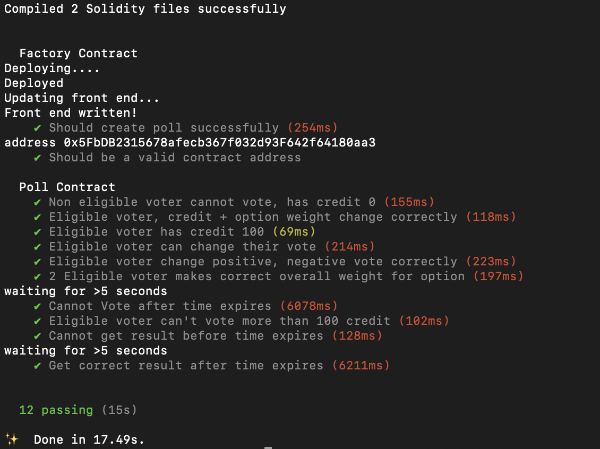

# Quadratic Voting Application 

What pain point are we addressing?

There are a lot of limitations to the tradition one-person-one-vote model of collective decision making. Minorities with strong interests may be drown out by the sea of majority voices and things like the "free-rider problem" pop up with the use of public goods. We need a new way of voting and collective decision making that not only represents how you feel about an issue, but also how strongly you feel about it. We need to give minorities with strong individual preferences the ability to make a stronger vote than someone who doesn't care as much about the issue. We need to have everyone's voices heard. We need voting to secure and anonymous. We also need a way to prevent malicious voting, from collusion to double voting. These are some of the problems that are not solved with tradition voting methods. Now that blockchain-enabled collective decision making allows votes to be tracked in a transparent, public way, more complicated voting systems can be adopted. By allowing voters to express not just their preferences but also the intensity of these preferences, quadratic voting protects the interests of small groups of voters that care deeply about certain issues and can provide some solutions to security, anonymity, and collusion.

How are we addressing this?

Quadratic voting is a collective decision-making procedure which involves individuals allocating votes to express the degree of their preferences, rather than just the direction of their preferences. By doing so, quadratic voting seeks to address issues of the Condorcet paradox and majority rule. Quadratic voting works by allowing users to "pay" for additional votes on a given matter to express their support for given issues more strongly, resulting in voting outcomes that are aligned with the highest willingness to pay outcome, rather than just the outcome preferred by the majority regardless of the intensity of individual preferences.

Why is this the best solution for the problem?

The payment for votes may be through either artificial or real currencies (e.g. with tokens distributed equally among voting members or with real money). Quadratic voting is a variant of cumulative voting. It differs from cumulative voting by altering "the cost" and "the vote" relation from linear to quadratic. By doing so, quadratic voting better protects the interests of small groups of voters that care deeply about particular issues. By increasing the cost of each additional vote, it disincentivizes voters that don’t care about issues from casting several votes for them. It also allows voters to show the intensity of their support for a given issue by casting several votes for it — at the expense of their ability to vote on other issues.

Why is our project different than existing solutions?

The are already some quadratic voting and quadratic funding platforms out there that allows votes to be cast for public goods and provide crowd funding for projects. There are currently no consumer facing applications that democratically pool money for group decision-making. We are focusing on a more everyday consumer focused approach to the problem. We want to design a mobile or app web that will allow any group to post issues or decisions that they want to make and let others in their group be able to vote on them, with the option to pool money or not. Issues can be as low-stakes as a group voting on where they should take a trip, which Airbnb to stay in, or where to have dinner to more seriouses issues like large organizations and institutions such as companies or uiversities making decisions on where to spend their money or what project to proceed with next. We also want to introduce the option of anonymous voting to protect the identities of the voters and to prevent malicious actions during the voting process.

How do you prevent voters from multiple accounts?

If the group is of a limited size and everyone knows the members of the group, this will not be an issue. For large groups, where members of not known, one possible solution is to have the creator of the group send out invites to join the group via special "nonce" that only those who are allowed to join can join. Another possible solution is to take the hash of a user's IP and make that a unique identifier. Thus there can only be one voter per IP address, and users cannot just simply make new accounts by creating a new address.
Smart contract tests:

Instructions
-Git clone ........

Set up backend
-cd back-qdvote
-yarn
-Crate your .env file [for future sake of testnet + auto link backend abi/contract address to frontend]
.env example
MATIC_RPC_URL = https://rpc-mumbai.maticvigil.com/v1/..........
PRIVATE_KEY = 8.......e [done use real one lol]
UPDATE_FRONT_END=true

Test backend
-yarn hardhat test 

Deploy backend to localhost
-yarn hardhat node [take note of private keys of generated accounts]
-yarn hardhat deploy —-network localhost (make sure to use two dashes)

Set up frontend
-cd front-qdvote
-yarn
-yarn dev 

btw this error below sometimes come up, but it seems not breaking anything
Ignore Unhandled Runtime Error
TypeError: Cannot read properties of undefined (reading 'itemCount')

Test App
-Import your localhost private key in Metamask, add localhost network and play around
-Local host may get confused sometimes, so use setting--> advanced--> reset account for 
your auto-generated address in metamask. [dont mess up your real account.]

References:
Basic logic inspired from: https://learn.figment.io/tutorials/build-a-quadratic-voting-dapp
Development stack is from: Hardhat, NextJS(basically React) inspired from https://www.youtube.com/watch?v=gyMwXuJrbJQ&t=63666s&ab_channel=freeCodeCamp.org
